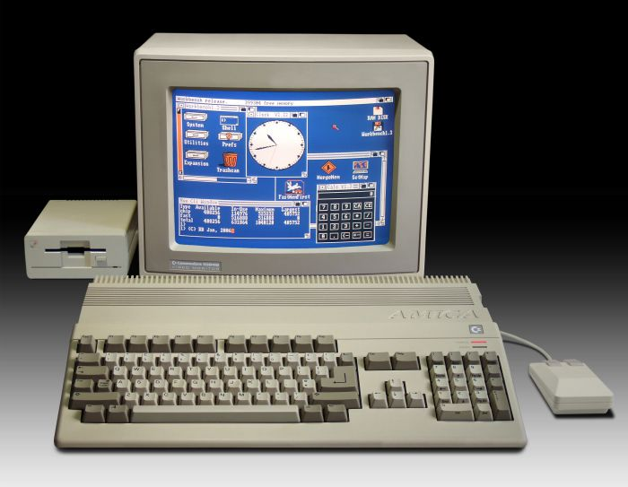
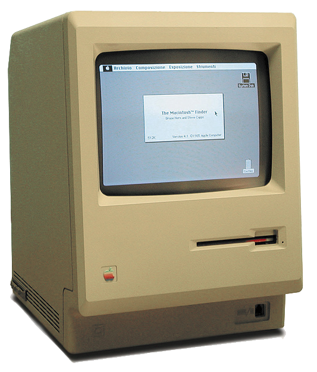
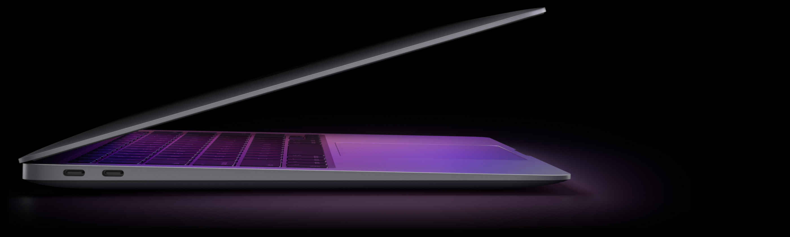

# -macintosh_128K-

*Ahh yes*, tech in the 20th century, or more specifically:

## Computers!!!!

> Isn't it beautiful?!

I mean, just look at it! Y'know? Look at all the detail! And the size of the hardware is just perfect! The convienient DVD player, the aesthetic of the mouse, and just imagine the *sounds* of the **keyboard!** ⌨️ 🖱️

What? You're not convinced? How dare you!!! By the end of this post, you will realize how unnecessarily **CLUTTERED** our computers are with unacceptable `RAM`sizes of 8 GB and `Computing Speeds` of more than 2 GHz, and you will begin to appreciate the complex design that *old* computers used to have and
the simplicity of the `specifications`!

~or you will realize how HORRENDOUS computers used to b-~
 > Ignore that, that's just my rationality. ;)
---

Now of course I could elaborate for hours on the magnifecence of **ALL** computers, but nothing outclasses:

## THE MACINTOSH 128K!!!

> Isn't it **MAGNIFECENT** ✨

This is the *perfect* computer! You just can't get better! Other older pieces of hardware are great and all, but **this**:

## Yes Indeed!

The blocky aesthetic old desktops used to have was *refined* to **PERFECTION**, the geometry is just incredible, and of course you have a *beautiful* logo
on the bottom right corner, and a *convinient* DVD player **integrated** into the computer itself!

Now what's even *better* are the specifications, just listen for a moment:[^1]

1. `CPU`: A *Motorola 68000 microprocessor* with a speed of 7.8336 MHz 💻
2. `GPU`: A Graphics Card **integrared** into the CPU! 🔌
3. `Storage`: A practical *Floppy Disk Drive* with a *HEFTY* **400 KB** of storage! 💾
4. `RAM`: An *OVERWHELMING* 128 KB of Memory!! 🎱
5. `Display`: An *extravagently*  **Monochrome** display of 9 inches (512x342)! 🖥️
6. `Power`: An *incredible* power of **60 WATTS!** 🔋
7. `Manufacturer`: Finally, the manufacturers of this device were of course ~the money hungry hippos~ Apple! 🍎

## 😮

---
You see? Look at that! **Simplicity!** It is *EXACTLY* what you need in your day to day life! Just think about it, who needs 8 GB of `RAM`, who needs 256 GB of `storage`, it's just pure *insanity*, and what's even *WORSE* is that modern computer design is too *simplistic!* Look at this absurdness:

That is an image of the computer I am currently using to make this webpage, the `M1 Macbook Air 2020`. It would *most certainly* be preferable to be using an old computer, but I wouldn't be able to show my passion for this old technology. 

> I guess I was born in the wrong generation 😞

Here are the obscene specs:[^2]:

1. `CPU`: A 3.2 GHz M1 chip with 8 cores and a neural engine with 16 cores!? 💻
2. `GPU`: An 8 core GPU integrated into the M1 chip!? 🔌
3. `Storage`: An **ungodly** 256 *gigabyte* Solid State Drive!? 💾
4. `RAM`: An *unexplainable* 8 *gigabytes* of memory!? 🎱
5. `Display`: A 13.3 inch *retina* display utilizing true tone technology with a resolution of 2560x1600?!?!?!? 🖥️
6. `Power`: A 49.9 watt-hour lithium-polymer battery. 🔋
7. `Manufacturer`: Lastly, the manufacturers of the computer I'm using are Apple (the same peole who made the Macintosh 128K) 🍎

Are you kidding me Apple? How could you go from making the *almighty* **Macintosh 128K** to a silly thing called a Macbook? Really? Calling it that because
you make *Mac* hardware and it folds like a book? How imaginative![^3] 🙄

Also, that design is *disgustingly* slim, a computer needs bulkiness to it, just like the Macintosh 128K, and a built in keyboard? And a trackpad? Seriously? Why bind them to a keyboard they may not like? Allow them to buy it for themselves!

Anyway...

---
You were able to make the battery more efficient and keep the GPU integrated, *unlike certain companies that make a seperate piece of hardware for it!* But you *still* increased the `CPU` speed AND `Storage` by a degree of more than a thousand, and gave us 8 GB of `RAM`! What?! 128 KB of `RAM` is more than enough for a standard person, 8 GB is absurd!!

---
I could go on for hours & hours on this matter, but I think enough has been said.

Maybe you learned something from reading this, or maybe you though it was completely absurd ~(which it kinda was)~.

But either way my point stands:

**The Macintosh 128K is truly a phenomenal piece of hardware and was a gem in the computer world**.

If you've made it this far, thank you, but until later:

# Goodbye!

[^1]:[Specs](https://apple-history.com/128k)
[^2]:[Specs](https://support.apple.com/kb/SP825?locale=en_US)
[^3]: For legal reasons that's a joke, please don't sue me Apple!
